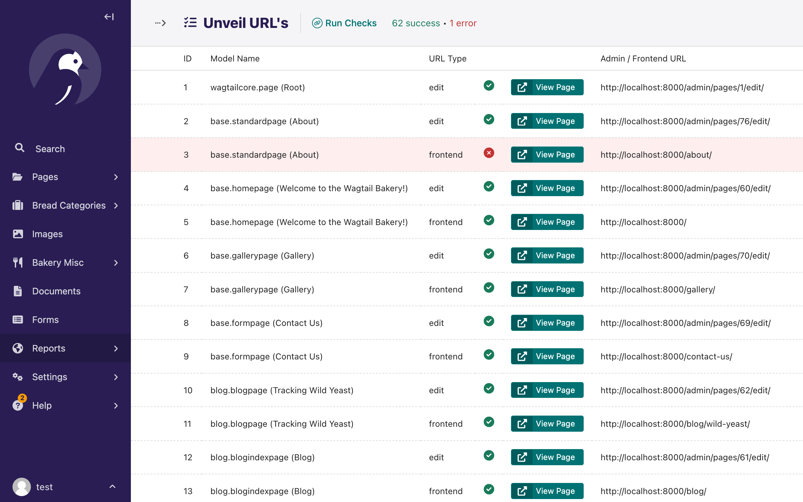

# Wagtail Unveil

A Wagtail package that helps map and expose admin and frontend URLs in your Wagtail project.

## Why Use This Package?

If you are unfamiliar with the project as a whole, Wagtail Unveil lets you quickly discover all admin and frontend URLs in your Wagtail project. This is especially useful after upgrading Wagtail or other dependencies, or when you have added new functionality and want to verify or document the available admin endpoints.

- **Instant URL Discovery:** See all admin and frontend URLs, including custom ModelAdmin and settings URLs.
- **Automated API Reports:** Get a machine-readable JSON index of all endpoints for integration, testing, or documentation.
- **Admin Reporting:** Visualize and validate endpoint accessibility directly in the Wagtail admin.
- **Automated Testing:** Use the included management command to programmatically check endpoint responses and automate health checks. URL testing currently covers the full CRUD view functionality plus frontend views. Some views, such as inspect-type views and similar, are not yet covered. (testing saving changes isn't supported but may be in the future.)
- **Easy Integration:** Simple setup and configuration, with a single token for secure API access.

## Features

### URL Discovery

Semi-automatically discovers and lists all available Wagtail admin and frontend URLs in your project.

### Report View

View your project's URLs in a user-friendly Wagtail admin interface with interactive URL validation: Check if URLs are accessible with visual success/error indicators.



### JSON API Endpoints

- Access all your project URLs via a JSON API endpoint.
- Includes a root API index endpoint (`/unveil/api/`) that lists all available API endpoints for easy discovery.
- Endpoints return detailed metadata for pages, snippets, ModelAdmin, ModelViewSet, settings, images, and documents.

#### Example API Index Response

```json
{
  "endpoints": {
    "collection": "http://localhost:8000/unveil/api/collection/",
    "document": "http://localhost:8000/unveil/api/document/",
    ...
  }
}
```

### API Authentication

- The API uses the standard `Authorization: Bearer <token>` header for authentication.

**Example usage with curl:**

```sh
curl -H "Authorization: Bearer YOUR_TOKEN" http://localhost:8000/unveil/api/collection/
```

### Command Line Interface

- Use the management command to quickly fetch and print the results of all API endpoints:

```sh
python manage.py unveil_urls --api-root=http://localhost:8000/unveil/api/ --token=YOUR_TOKEN
```

- The command requires a valid token and will output a dictionary of endpoint results.

## Install the package into your Wagtail project

Install via pip (or your preferred method):

```bash
pip install wagtail-unveil
```

**Note**: The package is not yet available on PyPI, so you may need to install it directly from this GitHub repository.

Add `wagtail_unveil` to your `INSTALLED_APPS`:

```python
INSTALLED_APPS = [
    # ...
    "wagtail_unveil",
    # ...
]
```

## Configuration

You can configure the package using the following settings in your settings file:

```python
# Maximum number of instances to show per model (default: 1)
# Set to 0 to show all instances
WAGTAIL_UNVEIL_MAX_INSTANCES = 1

# Token for API authentication
WAGTAIL_UNVEIL_JSON_TOKEN = "your-secret-token"
```

## Enabling the API

Add the following to your project's main `urls.py` file:

```python
from django.urls import include, path

urlpatterns = [
    # ... your existing URL patterns
    path("unveil/", include("wagtail_unveil.urls")),
    # ...
]
```

Once configured, you can access the API index at:

```
http://your-domain.com/unveil/api/
```

## Usage

### Command Line

Fetch all API endpoint results:

```bash
python manage.py unveil_urls --api-root=http://localhost:8000/unveil/api/ --token=YOUR_TOKEN
```

### Admin Views

The admin views provide reports on available endpoints and allow you to test the response code for each URL directly from the Wagtail admin.

## Development

For testing information, see the [Testing Guide](./docs/testing.md).

### Quick Test Setup

```bash
# Clone and setup
uv sync
source .venv/bin/activate
python manage.py migrate

# Run tests with the convenient script
python runtests.py --verbose
```

## Upcoming Features

See [issues](https://github.com/wagtail-packages/wagtail-unveil/issues) for planned features and suggestions.

## Contributing

Contributions are welcome! Please feel free to submit a Pull Request.

Before contributing, please:

1. Run the test suite with `python runtests.py`
2. Ensure all tests pass across supported environments with `tox`
3. Check the [Testing Guide](./docs/testing.md) for detailed testing information

## License

This project is licensed under the terms of the MIT license.
