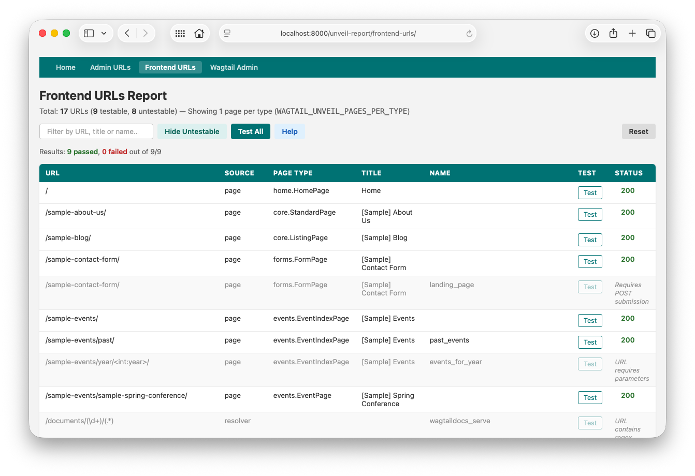

# wagtail-unveil

> Discover and test every URL in your Wagtail site — frontend and admin.

[](https://pypi.org/project/wagtail-unveil/)
[](https://pypi.org/project/wagtail-unveil/)
[](https://pypi.org/project/wagtail-unveil/)
[](https://github.com/nm-packages/wagtail-unveil/blob/main/LICENSE)



## Why?

Wagtail sites accumulate hundreds of URLs — admin views, page routes, routable sub-paths, API endpoints. Broken routes hide in plain sight until a user hits a 500 error. **wagtail-unveil** automatically discovers every URL in your site and lets you verify they all return 200 OK.

It exposes that discovery through JSON API endpoints, and (for superusers when `DEBUG=True`; see [Dashboard widget](#dashboard-widget) below) interactive HTML reports in Wagtail admin plus a dashboard panel linking to both reports.

## Features

- **Full URL discovery** — walks Django's URL resolver tree and Wagtail's page tree to find every admin and frontend route, including `RoutablePageMixin` sub-paths
- **Smart parameterized URL resolution** — automatically resolves URLs with parameters (snippets, images, documents, users) using real database instances so they become testable
- **Interactive HTML reports** — browser-based tables backed by the JSON API, with one-click testing, Test All with progress tracking, search, sort, and a Hide Untestable toggle
- **JSON API** — Bearer-token-authenticated endpoints for CI/CD integration and external monitoring tools, plus debug-only superuser session access for the built-in reports
- **Dashboard widget** — links to both reports directly from the Wagtail admin home page

## Quick Start

```bash
pip install wagtail-unveil
```

Add to your `INSTALLED_APPS`:

```python
INSTALLED_APPS = [
    # ...
    "wagtail_unveil",
    # ...
]
```

Run migrations:

```bash
python manage.py migrate
```

Add the HTML reports to your `urls.py` and browse them interactively:

```python
urlpatterns = [
    # ...
    path("unveil/", include("wagtail_unveil.urls")),
]
```

Then visit `/unveil/report/backend-urls/` or `/unveil/report/frontend-urls/` while logged in as a superuser (requires `DEBUG=True`).

## Usage

### HTML Reports

Interactive browser-based reports with one-click URL testing. Requires superuser login, `DEBUG=True`, and JavaScript.
The report page itself is a small shell that fetches its rows and summary counts from the matching JSON API endpoint, shows a full-screen loading state first, and reveals the report once the page is fully ready.

- **Admin URLs Report** — `/unveil/report/backend-urls/`
- **Frontend URLs Report** — `/unveil/report/frontend-urls/`

### JSON API

The API endpoints are included automatically when you add `wagtail_unveil.urls` (see Quick Start above).
Versioned API paths, URL names, and lifecycle state are derived from the internal
`wagtail_unveil.api_contract.API_VERSION_REGISTRY`.
For contributor policy on why/when/how to version, see
[docs/api-versioning.md](docs/api-versioning.md).

Set `WAGTAIL_UNVEIL_API_KEY` via environment variable (recommended) or Django settings, then query with a Bearer token.
If both are set, the environment variable takes precedence.

```bash
curl -H "Authorization: Bearer your-secret-key" http://localhost:8000/unveil/api/v1/backend-urls/
curl -H "Authorization: Bearer your-secret-key" http://localhost:8000/unveil/api/v1/frontend-urls/
```

Filter with `?filter=static`, `?filter=parameterized`, `?filter=pages`, or `?filter=resolver`.
Responses keep the existing top-level `urls` and `count` fields and also include a `metadata` object with:

- `api_version`
- `api_lifecycle`
- `generated_at`
- `applied_filter`
- `total_count`
- `testable_count`
- `untestable_count`
- `package_version`

`api_version` describes the response contract version. `api_lifecycle` describes whether that version is stable or deprecated, plus deprecation/sunset dates when set. `package_version` describes the installed `wagtail-unveil` release and is not the API version.

API lifecycle policy is summarized here, but the canonical maintainer guide is
[docs/api-versioning.md](docs/api-versioning.md). Breaking changes should ship
under a new versioned path such as `/unveil/api/v2/...`.

For the built-in HTML reports, the same versioned endpoints also accept a logged-in superuser session when `DEBUG=True` and the request is not attempting Bearer-token auth. The HTML reports are consumers of the JSON API, not a separate API contract.

For full API response examples and detailed feature documentation, see [docs/usage.md](docs/usage.md).

### Dashboard Widget

A panel on the Wagtail admin home page links directly to both reports (superuser + `DEBUG` only).

## Configuration

### `WAGTAIL_UNVEIL_PAGES_PER_TYPE`

Controls how many page instances per page type are included in the frontend URL report. Useful for sites with many pages of the same type where testing every one is unnecessary.

```python
# settings.py

# Test only 1 page per type (e.g., 1 HomePage, 1 BlogPage, 1 StandardPage)
WAGTAIL_UNVEIL_PAGES_PER_TYPE = 1

# Test up to 3 pages per type
WAGTAIL_UNVEIL_PAGES_PER_TYPE = 3

# Test all pages (no limit)
WAGTAIL_UNVEIL_PAGES_PER_TYPE = 0
```

Default behavior is `1` page per type when the setting is omitted.
Values are normalized to a non-negative integer. Invalid or negative values default to `1`.
Use `0` explicitly for no limit.

### `WAGTAIL_UNVEIL_SKIP_URL_PREFIXES`

A list of URL path prefixes to exclude from URL discovery. Useful when third-party packages register routes (e.g. `django-debug-toolbar`, `django-silk`) that you don't want to appear in the reports.

```python
# settings.py

# Exclude django-debug-toolbar routes
WAGTAIL_UNVEIL_SKIP_URL_PREFIXES = ["__debug__/"]

# Leading slashes are also accepted
WAGTAIL_UNVEIL_SKIP_URL_PREFIXES = ["/__debug__/", "/silk/"]
```

The setting applies to both the frontend resolver source and the admin URL discovery. Leading slashes are stripped internally, so `"/__debug__/"` and `"__debug__/"` are equivalent. Default is `[]` (no exclusions). Invalid values (non-list, non-string items) are silently ignored.

## Compatibility

| Python                        | Django              | Wagtail    |
|-------------------------------|---------------------|------------|
| 3.10, 3.11, 3.12, 3.13, 3.14 | 4.2, 5.1, 5.2, 6.0 | 7.0 – 7.3 |

## Development

These commands are for working on this repository's sandbox and test environment. They are not part of the public interface exposed by the reusable `wagtail_unveil` package.

```bash
make setup      # Full dev setup: env, install, migrate, superuser, sample data
make runserver  # Start the sandbox dev server
make test       # Run package tests
make test-js    # Run JavaScript report tests
make build-assets # Build report frontend assets (JavaScript + CSS)
make lint-assets # Lint/format-check frontend assets (JavaScript + CSS) with Biome
make tox        # Run tests across all Python/Django/Wagtail versions
make tox-smoke  # Run a fast smoke subset (min, modern, max supported stacks)
make lint       # Lint with ruff
make coverage   # Run tests with coverage report
make pre-commit # Run pre-commit hooks on all files
```

CI uses the smoke subset on pull requests/pushes for faster feedback, and runs the full tox matrix weekly plus manual dispatch.

JavaScript workflows use Node:

```bash
npm ci
npm run lint:assets
npm run lint:assets:fix
npm run test:js
npm run build:assets
npm run build:assets:watch
```

`build:assets` and `build:assets:watch` build both JavaScript bundles and report CSS artifacts.

Biome lint/format checks apply to contributor-owned frontend source files in `assets_src/`, `scripts/`, and `tests/js/` with `.js`, `.mjs`, `.cjs`, and `.css` extensions.

Frontend asset maintenance details (source layout, build/test workflow, CI expectations, and rebuild rules) are documented in [docs/frontend-assets.md](docs/frontend-assets.md).

Discovery now follows explicit internal phases for backend and frontend routes, and admin parameter resolution uses an ordered strategy pipeline; see [docs/discovery-architecture.md](docs/discovery-architecture.md) when changing fallback behavior or classification rules.

The sandbox also includes a deliberate failing frontend route at `/intentional-error/` so local report runs always have at least one visible error case.

See [AGENTS.md](AGENTS.md) for the full list of development commands and agent-facing project guidance.

## Releasing

Package publishing is handled by GitHub Actions through `.github/workflows/release.yml`.
Publishing a GitHub Release triggers a build + artifact validation + PyPI publish flow using PyPI Trusted Publisher (OIDC).

Maintainer checklist:

1. Bump `version` in `pyproject.toml`.
2. Merge to `main` and ensure CI is green.
3. Create a GitHub Release with a matching tag using `v` prefix (`vX.Y.Z` or pre-release like `vX.Y.Zrc1`).
4. Publish the GitHub Release and confirm the `Release` workflow succeeds.

For full setup instructions (including one-time PyPI Trusted Publisher configuration and troubleshooting), see [docs/releasing.md](docs/releasing.md).

## License

[MIT](LICENSE)
