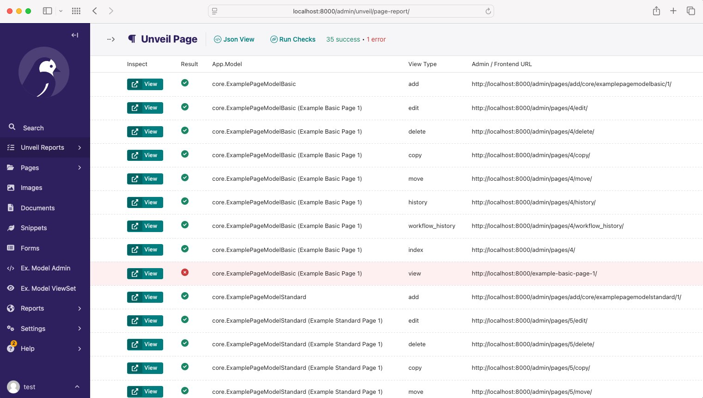

# Wagtail Unveil

This Wagtail package helps you discover and expose admin and frontend URLs in your Wagtail project by way of an admin report interface and a JSON endpoints.

## Features

Imagine you have a Wagtail project with multiple models, each having various URLs for admin and frontend views. Wagtail Unveil helps you:

- Discover available URLs for your models.
- View these URLs in the Wagtail admin interface.
- View URLs to ensure they return a valid response.
- View URLs in a JSON format.

### Report View

View a project's admin and frontend URLs in the Wagtail admin interface with interactive URL validation: Checks if URLs return a valid response and shows visual success/error indicators.



### JSON View

- Access project URLs via a JSON endpoint, the subset of URLs can be used to view urls of specific models.

#### Example API Index Response

```text
endpoints: {
  collection: "http://localhost:8000/unveil/api/collection/",
  document: "http://localhost:8000/unveil/api/document/",
  form: "http://localhost:8000/unveil/api/form/",
  generic: "http://localhost:8000/unveil/api/generic/",
  image: "http://localhost:8000/unveil/api/image/",
  locale: "http://localhost:8000/unveil/api/locale/",
  modeladmin: "http://localhost:8000/unveil/api/modeladmin/",
  page: "http://localhost:8000/unveil/api/page/",
  redirect: "http://localhost:8000/unveil/api/redirect/",
  search-promotion: "http://localhost:8000/unveil/api/search-promotion/",
  settings: "http://localhost:8000/unveil/api/settings/",
  site: "http://localhost:8000/unveil/api/site/",
  snippet: "http://localhost:8000/unveil/api/snippet/",
  user: "http://localhost:8000/unveil/api/user/",
  admin: "http://localhost:8000/unveil/api/admin/",
  workflow: "http://localhost:8000/unveil/api/workflow/",
  workflow-task: "http://localhost:8000/unveil/api/workflow-task/"
}

```

## Install the package into your Wagtail project

Install via pip (or your preferred method):

```bash
pip install wagtail-unveil
```

**Note**: The package is not yet available on PyPI, so you will need to install it directly from <https://github.com/nm-packages/wagtail-unveil>

Add `wagtail_unveil` to your `INSTALLED_APPS`:

```python
INSTALLED_APPS = [
    # ...
    "wagtail_unveil",
    # ...
]
```

## Configuration

You can configure the package using the following settings in your settings file:

```python
# List of models to include in the Generic Models report
# These should be models managed by ModelViewSet or other generic views
WAGTAIL_UNVEIL_GENERIC_MODELS = ['core.ExampleModelViewSetModel']

# List of Wagtail ModelAdmin models to include in the Wagtail ModelAdmin report
# These should be models registered with Wagtail's ModelAdmin
WAGTAIL_UNVEIL_WAGTAIL_MODELADMIN_MODELS = ['core.ExampleWagtailModeladminModel']

# Maximum number of instances to include per model in unveil reports
WAGTAIL_UNVEIL_MAX_INSTANCES = 1 # optional, the default is

# Position the Unveil reports menu item in the Wagtail admin menu
WAGTAIL_UNVEIL_MENU_ORDER = 1 # optional, the default is 1

# Base URL for generating URLs in reports
# This should be the base URL of your Wagtail site, e.g. "http://localhost:8000"
WAGTAIL_UNVEIL_BASE_URL = "http://localhost:8000"

# Token for accessing the JSON API endpoints
# This is used for authentication when accessing the API endpoints.
# Admin users can access the API without a token, but for external access, you should set this.
WAGTAIL_UNVEIL_JSON_TOKEN = "1234"
```

## Enabling the API

Add the following to your project's main `urls.py` file:

```python
from django.urls import include, path

urlpatterns = [
    # ... your existing URL patterns
    path("unveil/api/", include("wagtail_unveil.api_urls")),
    # ...
]
```

### Management Commands

**Fetch all API endpoint results:**

```bash
python manage.py unveil_urls
```

## Contributing

Contributions are welcome! Please feel free to submit a Pull Request.

### Quick Development Setup

1. **Clone the repository**:

   ```bash
   git clone https://github.com/nm-packages/wagtail-unveil.git
   cd wagtail-unveil
   ```

2. **Install dependencies** (choose one method):

   **Using uv (recommended)**:

   ```bash
   uv sync --dev
   ```

   **Using pip**:

   ```bash
   python -m venv venv
   source venv/bin/activate  # On Windows: venv\Scripts\activate
   pip install -e ".[dev]"
   ```

3. **Run the example project**:

   ```bash
   python manage.py migrate
   python manage.py createsuperuser
   python manage.py runserver
   ```

4. **Run tests**:

   ```bash
   python runtests.py
   ```

**Generate example content for development and testing:**

```bash
python manage.py generate_content
```

This command creates sample data including:

- Images (5 programmatically generated colored images)
- Documents (5 files of different types: txt, csv, json, xml, md)
- Snippets (registered snippets and ViewSet snippets)
- Pages (basic and standard pages with banner images)
- Form pages (with sample form submissions)
- Search promotions, collections, and redirects
- Example models for ModelViewSet and ModelAdmin

*Note: The command only creates content if it doesn't already exist, so it's safe to run multiple times.*

## License

This project is licensed under the terms of the MIT license.
