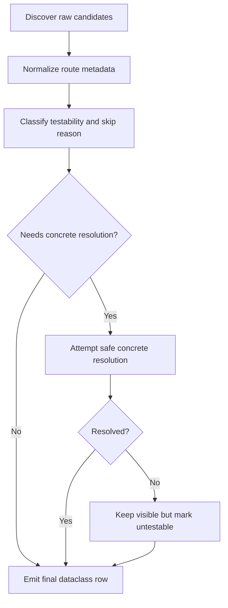
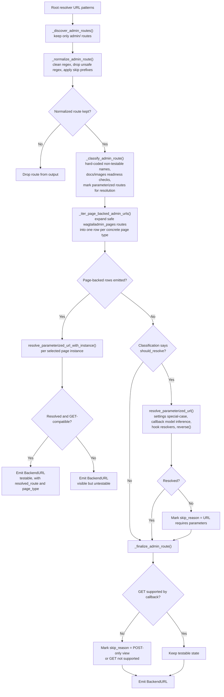
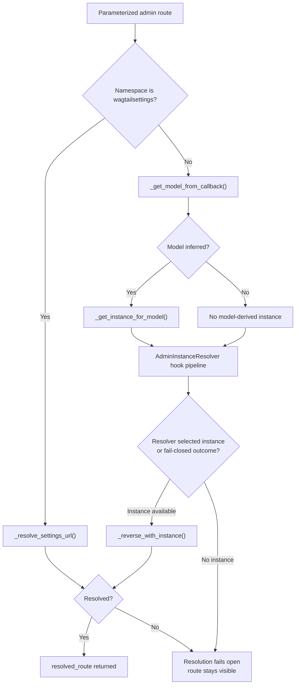
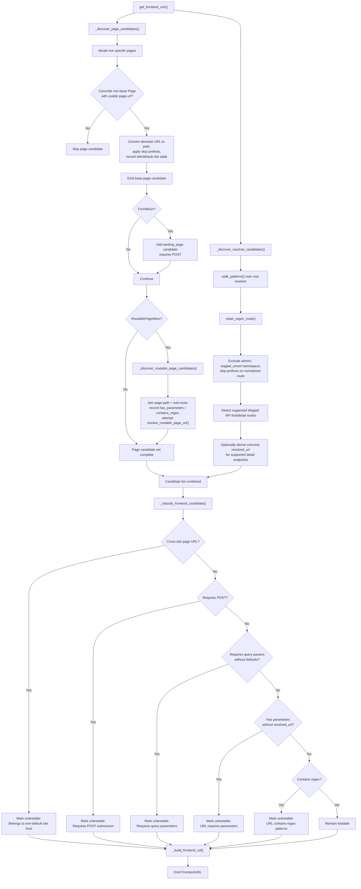

# Discovery Workflow Visual Reference

## Read This If...

Read this page if you want a visual companion to the discovery pipeline before or alongside the canonical architecture reference.

## Purpose

This document is a maintainer-facing visual companion to
[discovery-architecture.md](https://github.com/nm-packages/wagtail-unveil/blob/main/docs/contributing/discovery-architecture.md).
Use this page to understand the shape of the discovery pipelines and where
classification, resolution, and final dataclass emission happen. Use the
architecture document for the authoritative rules, special cases, and
limitations behind each branch.

Primary implementation files:

- `wagtail_unveil/discovery/backend.py`
- `wagtail_unveil/discovery/backend_resolution.py`
- `wagtail_unveil/discovery/extensions.py`
- `wagtail_unveil/discovery/frontend.py`
- `wagtail_unveil/discovery/frontend_resolution.py`
- `wagtail_unveil/discovery/utils.py`
- `wagtail_unveil/settings.py`

## Shared Phase Model

Both discovery pipelines follow the same broad shape even though the concrete
sources and resolution steps differ.

Shared helper layer:

- `walk_patterns()` walks Django resolver trees and emits route metadata.
- `clean_regex_route()` converts regex-style route fragments into safer
  path-style placeholders where possible.
- `route_has_parameters()` and `route_contains_regex()` determine whether a
  route can be tested directly or needs later handling.
- `get_skip_url_prefixes()` can remove candidates before they become public
  output.

## Backend Workflow

`get_admin_urls()` in `wagtail_unveil/discovery/backend.py` orchestrates
admin URL discovery.

### Backend Resolution Branches

The generic parameter-resolution path in
`wagtail_unveil/discovery/backend_resolution.py` is itself a short strategy
pipeline:

Maintainer-specific branches to keep in mind:

- Safe `wagtailadmin_pages` routes do not use the generic callback-model path
  first. They are expanded by page type through `_iter_page_backed_admin_urls()`.
- `add_subpage` uses compatible parent pages only, via
  `get_add_subpage_parent_page_instances_by_type()`.
- Hook resolvers from `get_registered_admin_instance_resolvers()` can either
  supply a fallback instance or override an earlier choice.
- Failed resolution does not remove the row. It only changes the emitted
  `BackendURL` to an untestable one with `skip_reason`.

## Frontend Workflow

`get_frontend_urls()` in `wagtail_unveil/discovery/frontend.py` merges
page-derived and resolver-derived candidates before classification.

### Frontend Resolution Notes

- Page-derived candidates can produce multiple rows for a single page:
  base page, form landing page, and routable sub-routes.
- `WAGTAIL_UNVEIL_PAGES_PER_TYPE` limits page-derived selection inline during
  `_discover_page_candidates()` but does not affect resolver-derived URLs.
- `resolve_routable_page_url()` only resolves a narrow safe subset of
  single-parameter path-style routable sub-routes.
- `get_wagtail_api_detail_resolved_url()` only resolves supported Wagtail API
  detail endpoints when a representative object exists.
- Frontend discovery keeps many untestable URLs visible by design so reports
  still show the full reachable surface area.

## Decision Points That Make URLs Untestable

Discovery and testability are intentionally separate in this package. The main
reasons a discovered URL stays visible but is not directly testable are:

- backend hard-coded non-testable admin names such as logout or import actions
- backend serve-readiness checks for document and image endpoints
- backend parameterized routes that cannot produce a concrete `resolved_route`
- backend callbacks that do not support `GET`
- frontend form landing pages that require `POST`
- frontend query-driven resolver routes such as supported Wagtail API `find`
  endpoints
- frontend routable or resolver routes that still require path parameters
- frontend routes that still contain regex constructs after normalization
- page URLs that belong to a non-default Wagtail `Site`

## Where To Change Behavior

Start with the visual flow above, then use the canonical deep reference:
[discovery-architecture.md](https://github.com/nm-packages/wagtail-unveil/blob/main/docs/contributing/discovery-architecture.md).

The main implementation entry points are:

- `wagtail_unveil/discovery/backend.py` for admin orchestration and final
  `BackendURL` emission
- `wagtail_unveil/discovery/backend_resolution.py` for parameterized admin
  resolution strategies
- `wagtail_unveil/discovery/extensions.py` for admin instance resolver hooks
- `wagtail_unveil/discovery/frontend.py` for frontend candidate discovery,
  classification, and final `FrontendURL` emission
- `wagtail_unveil/discovery/frontend_resolution.py` for routable and API
  concrete URL inference
- `wagtail_unveil/discovery/utils.py` for shared resolver walking and route
  normalization helpers
- `wagtail_unveil/settings.py` for discovery-affecting settings such as page
  limits and skip prefixes
