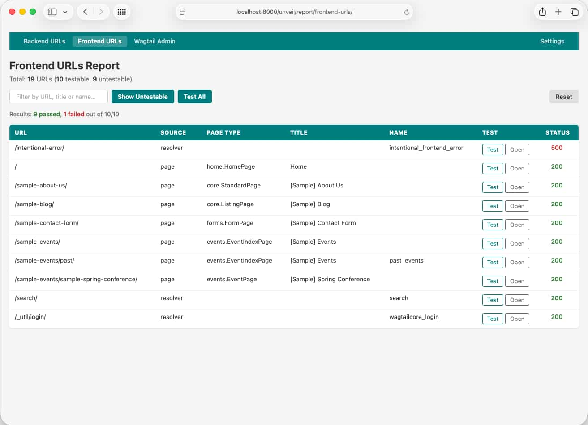

# Frontend URLs Report

The frontend URLs report discovers and displays all frontend URLs in your project — from live Wagtail pages and from the Django URL resolver.

## Access

Visit `/unveil/report/frontend-urls/` while logged in as a superuser with `DEBUG=True`.

You can also reach it from the Wagtail admin dashboard panel.

## Features

- **Two URL sources** — Wagtail page URLs (from `Page.objects.live().specific()`) and Django resolver URLs (non-admin routes)
- **RoutablePageMixin support** — automatically discovers `@path()` and regex `@route()` sub-routes on routable pages; static sub-routes are testable, supported single-parameter path sub-routes use inferred concrete URLs for testing, and regex literal patterns remain visible but non-testable
- **Query-aware resolver testing** — query-driven Wagtail API `find/` routes stay visible with their canonical path while the Test/Open actions use representative query parameters when safe example inputs can be inferred
- **Configurable page limit** — control how many page instances per type are included via [`WAGTAIL_UNVEIL_PAGES_PER_TYPE`](../configuration/settings-reference.md#wagtail_unveil_pages_per_type)
- **One-click URL testing** — colour-coded status codes (green=2xx, yellow=3xx, red=4xx/5xx)
- **Test All** button — runs all testable URLs sequentially with a progress indicator and pass/fail summary
- **Hide Untestable toggle** — hides non-testable rows; preference saved in a cookie across sessions
- **Searchable and sortable columns** — sort by URL, Source, Page Type, Title, or Name
- **Self-contained** — no external CSS or JS dependencies

## URL Sources

### Wagtail Page URLs

Discovered from `Page.objects.live().specific()`. Includes:

- Base page URL for each live page
- Form landing page URLs for pages using `FormMixin`
- Sub-route URLs for pages using `RoutablePageMixin`

### Django Resolver URLs

Discovered by walking the root URL resolver. Excludes:

- Routes under `admin/` and `django-admin/`
- Routes in the `wagtail_unveil` namespace
- Any prefixes configured in `WAGTAIL_UNVEIL_SKIP_URL_PREFIXES`

## Untestable URLs

Some frontend URLs cannot be tested directly:

- Parameterised routes (e.g. `<slug:slug>`)
- Routes with regex patterns, including regex-based `RoutablePageMixin` sub-routes
- Pages belonging to non-default Wagtail sites
- Form landing pages (POST-only)
- Query-driven routes when no representative query parameters can be discovered

When a routable page path parameter can be resolved safely, the row stays visible with its canonical pattern while the Test/Open actions use the inferred concrete URL. Query-driven Wagtail API `find/` routes behave similarly: the canonical path stays visible while the actions use inferred query parameters. URLs that still cannot be resolved remain visible in the report with a reason.

## Related

- [Backend URLs Report](backend-urls-report.md) — Test Wagtail admin URLs
- [Configuration](../configuration/settings-reference.md) — Control page limits and URL exclusions
- [API Reference](../api/endpoints.md) — Query frontend URLs via the JSON API
- [Features Index](index.md) — Back to section overview
